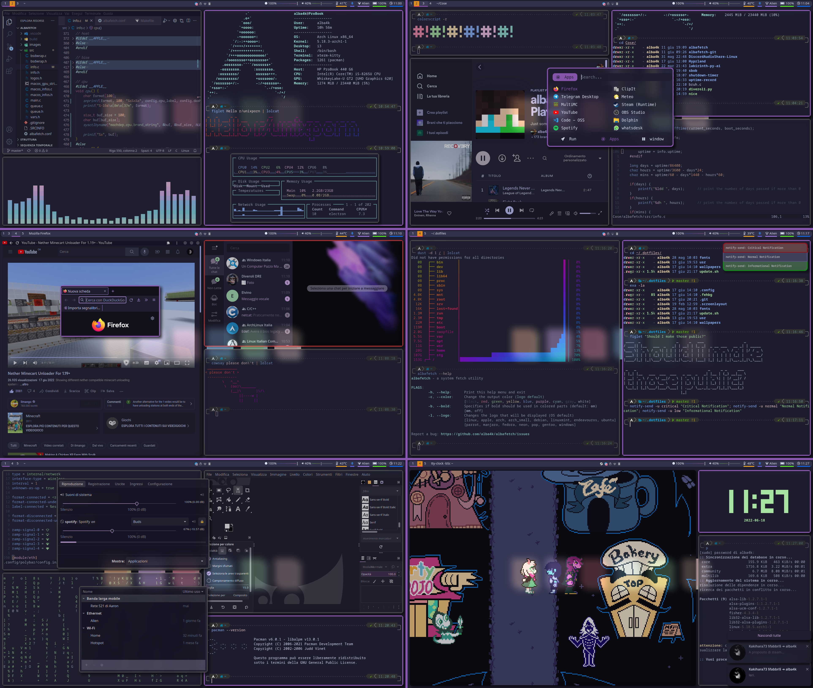

# alba4k's dotfiles

## my dotfiles, shown in [this](https://www.reddit.com/r/unixporn/comments/vf2tej/i3gaps_well_i_like_purple_anybody_here_good_with/) r/unixporn post

---

## Here are my configurations for the following programs:
* cava
* dunst
* fish
* flameshot
* hyprland (wouldn't use those)
* i3-gaps
* kitty
* libinput-gestures
* neofetch
* neovim
* picom
* polybar
* rofi
* sway (wouldn't use those)
* uptime-record
* albafetch

->
>=
<=

