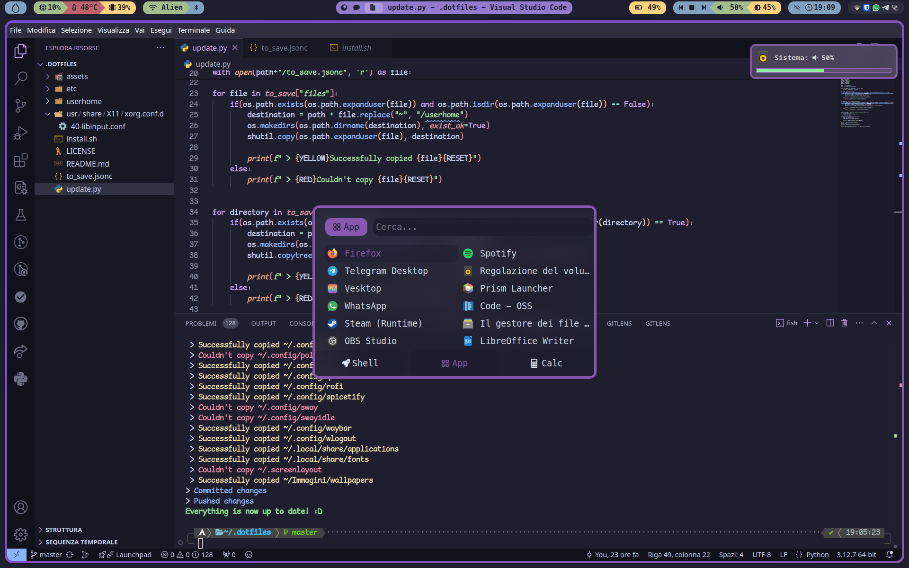

# alba4k's dotfiles

 A really old picture 

## my dotfiles, shown in [this](https://www.reddit.com/r/unixporn/comments/vf2tej/i3gaps_well_i_like_purple_anybody_here_good_with/) r/unixporn post

---

## Here are my configurations for the following programs:
* cava
* dunst
* fish
* flameshot
* hyprland (wouldn't use those)
* i3-gaps
* kitty
* libinput-gestures
* neofetch
* neovim
* picom
* polybar
* rofi
* sway (wouldn't use those)

Programs I wrote myself

* [uptime-record](https://github.com/alba4k/uptime-record) (not really a config, just a backup)
* [albafetch](https://github.com/alba4k/albafetch)

---

## This repo also includes some of the fonts needed (everything else is in the noto-fonts package) and a couple of scripts

---

# I would really like you to **not** just steal my dotflies, take inspiration from them! they're already pretty much just a copy of [those](https://github.com/catppuccin)

### alba4k - 2022